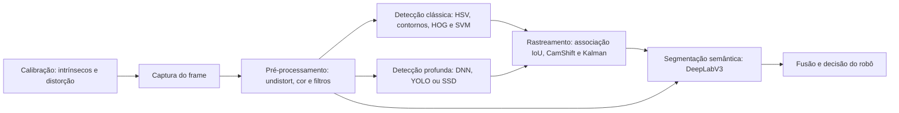

# Relatório técnico integrativo — percepção visual para robótica

## Escopo e dados

Este relatório sintetiza os TPs e os quatro exercícios. As medições foram feitas em CPU, mas variam em resolução e conjunto; não são um benchmark controlado. Consumo elétrico não foi medido. Foram usados Imagenette, Penn-Fudan, MOT15, KITTI, vídeo público de tabuleiro e dados sintéticos; nada disso é coleta própria da webcam.

## Pipeline de percepção

A calibração estima a geometria e permite corrigir a distorção. Detecção clássica e profunda atuam em paralelo; rastreamento associa objetos entre frames e segmentação classifica pixels. Fusão com sensores e controle são etapas propostas, não implementadas.

## Técnicas e resultados medidos

| Técnica | Resultado coletado | Custo e limite da evidência |
|---|---|---|
| Calibração, `undistort` e pose | 16 vistas; RMS global 0,953 px, média por vista 0,862 px; ajuste em 1.022 ms. Pose detectada em 97/100 frames, a 27,82 ms/frame. | Calibração offline; vídeo público. Unidade de translação é o lado do quadrado, não metro. |
| Conversão HSV/LAB | HSV 1,33 ms e LAB 2,42 ms por imagem; MAE de reconstrução 0,287 e 0,364. | Operações baratas; MAE mede conversão, não acurácia de percepção. |
| Limiar global, adaptativo e Otsu | 0,44/3,42/0,75 ms; contornos válidos: 15/12/13. Foreground: 71,61%/87,87%/69,56%. | Baixa complexidade; sem máscara ground truth, não há precisão ou IoU. |
| ORB, SIFT e AKAZE | 8,08/106,56/69,00 ms; 500/3.422/2.214 pontos, respectivamente. | ORB é leve por usar descritores binários; SIFT e AKAZE custaram mais nesta cena. Pontos não medem acurácia de correspondência. |
| HOG pré-treinado | Em 20 imagens: modo rápido, 7,46 ms/frame e zero caixas; modo preciso, 128,10 ms/frame e 62 caixas no total. | Janelas e escalas aumentam o custo. Contagens não são precisão sem comparação com caixas anotadas. |
| HOG + SVM RBF próprio | 100 positivos e 100 negativos; teste de 40 recortes: acurácia, precisão e recall de 100%; 1.076 janelas e 20 caixas após NMS. | A janela não foi cronometrada isoladamente; custo cresce com posições, escalas e vetores de suporte. Teste pequeno. |
| MOG2/KNN, CamShift e Kalman | No vídeo sintético de 180 frames: MOG2 1,89 ms/frame; KNN 2,85 ms/frame. RMSE do centro: medição 2,45 px, predição 1,56 px, correção 1,29 px. | Baixo custo neste cenário fixo. Q representa ruído de processo, R ruído de medição e P incerteza do estado; RMSE vale apenas para a trajetória sintética conhecida. |
| MobileNetV2: OpenCV DNN/Keras | Dez imagens Imagenette, top-1 de 80% em ambos; latência de 14,74/18,93 ms e RSS de 94,1/398,2 MB. | DNN foi mais leve e rápido neste computador. Dez imagens não estimam desempenho geral; RSS inclui o runtime. |
| CNN, PCA e ORB | Em setas sintéticas, acurácia de teste: CNN baseline 91,88%, regularizada 56,25%, augmentation 100%; separabilidade PCA: silhouette CNN 0,711 e ORB -0,006. | Inferência em batch de 0,30–0,48 ms/imagem. Resultado didático sintético, não desempenho em robótica. |
| YOLOv4-tiny/SSD MobileNetV2 | MOT15, 179 frames: latência 64,50/62,48 ms; precisão 0,987/0,989; recall 0,798/0,687; pesos 23,13/66,46 MB. | SSD foi ligeiramente mais rápido; YOLO teve maior recall e modelo menor. Ambos ficaram perto de 15 FPS em CPU. |
| Associação IoU e rastreamento | YOLO: 11 ID switches em 7,16 s, ou 92,18/min por extrapolação; 17 entradas e 11 saídas de tracks. | A taxa por minuto é instável neste clipe curto; oclusões podem fragmentar IDs. |
| DeepLabV3 e HSV | Cinco cenas: 497,98 ms/imagem em média para DeepLabV3 e 0,80 ms para HSV. | HSV detecta uma faixa de cor; DeepLab classifica pixels. Pesos VOC não incluem pista/calçada e não há máscaras ground truth para mIoU. |

No pipeline integrado do Exercício 2, uma imagem levou 97,86 ms: captura de arquivo 5,79 ms, `undistort` 3,73 ms, HSV 1,13 ms, ORB 5,92 ms, HOG+SVM 64,59 ms e DNN da ROI 16,69 ms. A execução sequencial e a instrumentação funcionam, mas a calibração vem de outra câmera que a imagem Penn-Fudan; esse tempo não valida a correção geométrica. Também não se deve comparar diretamente métricas de tarefas e conjuntos diferentes. Quando não existe anotação de referência, o relatório informa a saída e o tempo, sem inventar acurácia.

## Viabilidade em hardware de 5 W

Os resultados não comprovam operação em 5 W; faltam medições de energia, temperatura, memória e FPS sustentado no dispositivo final. Conversão de cor, limiarização e ORB são candidatos leves para CPU, condicionados à cena. MOG2/KNN foram rápidos no vídeo fixo, mas sofrem com movimento e iluminação. HOG preciso e HOG+SVM restringem resolução ou frequência pelo custo das janelas. MobileNet via OpenCV DNN foi mais rápido e econômico em RSS que Keras neste teste. YOLOv4-tiny é o melhor ponto de partida entre YOLO e SSD por maior recall e menores pesos, embora ambos atinjam apenas cerca de 15 FPS. DeepLabV3, a meio segundo por imagem, é lento para segmentação frequente em CPU. NPU, quantização e inferência semântica menos frequente podem ajudar, mas exigem novos benchmarks.

## Arquitetura proposta para veículo urbano

Eu usaria câmera calibrada e `undistort`; HSV para marcadores coloridos; ORB para localização; YOLOv4-tiny para detectar usuários e veículos; associação IoU e Kalman para manter IDs e suavizar movimento; e segmentação semântica urbana para pista e calçada. O planejador receberia classes, trajetórias e incertezas; regras de segurança tratariam falhas e desacordos. A proposta integra várias técnicas, mas os ensaios não validam o sistema completo. O projeto deve minimizar armazenamento visual, evitar identificação de pessoas e permitir auditoria humana.

## Lacunas para a DR4 — Veículos Autônomos e Robótica Móvel

1. **Geometria:** calibrar a câmera final com tabuleiro medido, validar erro na imagem e integrar odometria/profundidade para estimar posição métrica.
2. **Generalização:** obter dados urbanos licenciados de chuva, noite, contraluz e diversos usuários; medir precisão, recall e mIoU por classe, condição e casos raros.
3. **Integração embarcada:** medir energia, temperatura, memória, FPS e latência no hardware de 5 W; avaliar perda de IDs, falha de sensores e resposta segura.

Dados e fontes estão em [DATASETS_PUBLICOS.md](DATASETS_PUBLICOS.md); detalhes e reprodução, em [EX1.md](EX1.md), [EX2.md](EX2.md), [EX3.md](EX3.md) e [EX4.md](EX4.md). As métricas dependem do computador e dos conjuntos usados; não substituem validação em campo.
